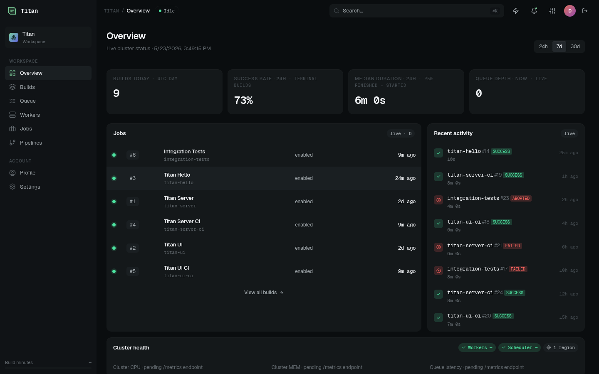

# Titan

**A cloud-native CI/CD engine where the controller runs no user code, every build is just rows in Postgres, and workers simply pull.**

YAML pipelines compiled to a validated static DAG · a stateless control plane you can kill mid-build · pull-based workers that need nothing but a database connection · a real React/TanStack UI with live logs.




> More screens: [builds](docs/screenshots/03-builds.png) · [build detail (DAG + live console)](docs/screenshots/04-build-14-success.png) · [queue](docs/screenshots/07-queue.png) · [workers](docs/screenshots/08-workers.png)

---

## Quickstart — green pipeline in minutes

**Fastest — Docker only, no build:** pull the published images and bring up the full rig.

```sh
git clone https://github.com/hadamrd/titan.git
cd titan
task quickstart   # pulls ghcr.io/hadamrd/titan-* → postgres + keycloak + server + ui + worker, seeded
```

**From source:** build everything locally (needs JDK 21 + Node).

```sh
git clone https://github.com/hadamrd/titan.git
cd titan
task setup        # one-time: JDK 21 + git hooks
task dev:titan    # builds, then brings up the rig
```

Either way, open **http://localhost:5180**, log in as `dev` / `dev`, and you're looking at real builds running against a real worker. Tear down with `task dev:down`.

`task` is a single binary — [taskfile.dev/installation](https://taskfile.dev/installation/). The from-source path also runs through the Gradle wrapper (`./gradlew`).

---

## Why Titan

Most CI engines fuse two jobs that want opposite properties — turning a pipeline into a plan, and running that plan. Titan splits them, and that split is the product.

- **The controller runs no user code.** Your YAML is synthesized into a plan on a *worker*, then baked into an immutable static DAG before a single step runs. No scripting engine on the controller, no sandbox to escape, no pipeline program trapped in a process heap.
- **All state lives in PostgreSQL.** A build is just rows: the baked DAG, per-node progress, in-flight leases, step outputs. The controller is stateless — kill it mid-build and a survivor reconciles from the database and continues. Recovery is *reconcile, not resume*; there's no event history to replay.
- **Workers pull, they don't get pushed.** A worker needs only a DB connection string — no inbound ports. It claims work with `FOR UPDATE SKIP LOCKED` under a lease token, so two workers never run the same task and a zombie can't double-write. Scale horizontally off one queue.
- **Strict typed YAML, a schema generated from one grammar source, a real React/TanStack UI, OIDC + scoped-PAT auth, and ServiceLoader extension points** for steps, triggers, artifact stores, and secret backends.

Full detail and an honest, tool-by-tool comparison: **[docs/why-titan.md](docs/why-titan.md)**.

| Dimension | **Titan** | GitHub Actions | GitLab CI | Buildkite |
|---|---|---|---|---|
| Where execution state lives | PostgreSQL — single source of truth; processes stateless | GitHub service | GitLab service DB | Buildkite control plane |
| Recovery model | Reconcile from DB rows; kill any process and continue | Platform-managed | Platform-managed | Platform-managed |
| What runs the pipeline definition | Controller runs **no** user code → static DAG | Runner interprets YAML | Runner interprets YAML | Agent-uploaded pipeline |
| Worker → control-plane coupling | Pull-based; worker needs only a DB string | Runners poll GitHub | Runners poll GitLab | Agents poll Buildkite |
| Self-hosting | Fully self-hosted (your Postgres, IdP, workers) | Control plane is GitHub's | Self-managed or SaaS | SaaS control plane + self-hosted agents |
| Maturity / ecosystem | **Young** (1.0.0-rc1), small ecosystem | Very mature, vast | Mature | Mature |

Titan is young and single-tenant today; the incumbents win on ecosystem and maturity. Titan wins on operational model — statelessness, durability, and a control plane that can't be wedged by user code.

---

## Architecture at a glance

```mermaid
flowchart LR
    SCM["SCM / webhook<br/>(GitHub, cron)"] -->|trigger build| CTRL

    subgraph CTRL["Controller (titan-server, Quarkus) — runs NO user code"]
        direction TB
        PARSE["parse + synthesize<br/>→ PipelineModel"] --> BAKE["bake<br/>→ static DAG (flow_nodes)"]
        BAKE --> ADV["advance()<br/>reconcile DAG, enqueue tasks"]
    end

    CTRL -->|enqueue tasks| DB
    CTRL -->|reconcile rows| DB

    subgraph DB["PostgreSQL — single source of truth (titan.*)"]
        direction TB
        Q["task_queue<br/>(durable pull queue)"]
        B["builds<br/>(immutable pipeline_model_json)"]
        FN["flow_nodes<br/>(per-node DAG state)"]
    end

    DB -->|claim via FOR UPDATE SKIP LOCKED| W
    W -->|complete (lease-token guarded)| DB

    subgraph W["Workers (titan-worker, pull-based, N replicas)"]
        direction TB
        EXEC["execute steps<br/>in build-scoped workspace"] --> STREAM["stream logs + heartbeat"]
    end

    W -->|ServiceLoader SPI| ART["Artifact stores<br/>(S3 / Nexus / fs)"]
    W -->|ServiceLoader SPI| SEC["Secrets / KEK<br/>(db-envelope / Infisical)"]

    DB -->|REST + SSE| UI["titan-ui<br/>React/Vite SPA<br/>(live logs over SSE)"]
    CTRL -.->|serves API| UI
```

Nine Gradle modules, one Postgres, one Keycloak. `rig/local/` is the docker-compose dev rig; `rig/k3s/` is a Helm chart with TLS ingress and multiple worker replicas. Deep dive: [docs/architecture/](docs/architecture/).

---

## Pipelines

A pipeline is a YAML file in your repo (`.titan/pipelines/`). The file on disk is the contract — no in-UI mutation drift.

```yaml
stages:
  - stage: Test
    matrix:
      axes:
        node: ["20", "22"]
      maxParallel: 2
    steps:
      - sh: npm ci
      - sh: npm test -- --reporters=jest-junit
      - junit: "junit.xml"

  - stage: Build
    dependsOn: [Test]
    steps:
      - sh: npm run build
      - archiveArtifacts: "dist/**"
```

The PDL supports `matrix:`/`each:` fan-out with `dependsOn` fan-in, `when:` (CEL) conditionals, `retry:`, `onFailure:`, `gate:` approvals, typed `credentials:`, `notify:` hooks, cron + SCM-webhook `triggers:`, and reusable `templates:`/`libraries:`. Full grammar: [docs/reference/pdl.md](docs/reference/pdl.md).

### Copy-paste examples → [`examples/`](examples/)

Runnable, schema-validated pipelines for real stacks: [node](examples/node-app/) · [python (version matrix)](examples/python-app/) · [go](examples/go-app/) · [java/gradle](examples/java-gradle/) · [monorepo fan-out](examples/monorepo-matrix/) · [the full PDL tour](examples/showcase/).

---

## Built with autonomous AI loops

Almost all of Titan — the Quarkus control plane, the durable state machine, the pull-based worker, the YAML pipeline language, the React UI — was designed and built by autonomous AI coding agents running in a *supervised loop*: twelve file-scoped specialists dispatched in parallel into isolated worktrees, gated by a pre-dispatch vision oracle, five hard pre-review checks, and a same-tier critic, with a human as the only merge authority.

It's not a slogan — every claim points at a file you can open. The honest account (what "autonomous" really means, what worked, what was hard, and what a human still does) is in **[docs/building-with-ai/](docs/building-with-ai/README.md)**, with a long-form [case study](docs/building-with-ai/case-study.md).

> *The model is the commodity; the discipline is the product.*

---

## Documentation

Start at the [docs index](docs/README.md).

- [Getting started](docs/getting-started.md) — install, run the rig, ship your first pipeline
- [Concepts](docs/concepts/) — the mental model · [Architecture](docs/architecture/) — the internals
- [Reference](docs/reference/) — PDL grammar, steps, config, schema, SPIs
- [Why Titan](docs/why-titan.md) · [Decisions (ADRs)](docs/decisions/) · [Operations](docs/operations/)

## Status

**1.0.0-rc1** — the first release candidate on the road to 1.0. Single-tenant; multiple pull-based workers off one queue (claim isolation proven by an integration test); cron + GitHub/Bitbucket webhook triggers; local docker rig and a k3s Helm chart; OIDC + scoped-PAT auth and an audit log. See [CHANGELOG.md](CHANGELOG.md) for the upgrade path and known limits.

## Contributing

PRs welcome — see [CONTRIBUTING.md](CONTRIBUTING.md) (branch off `trunk`, `task verify`, Spotless). The docs tree is curated: [docs/maintaining-docs.md](docs/maintaining-docs.md). AI-first contributors especially welcome — see the [case study](docs/building-with-ai/case-study.md).

## License

[MIT](LICENSE.md).
