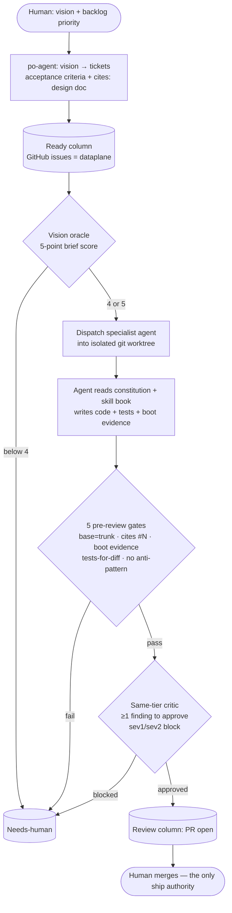

# Building Titan with AI

Titan is a standalone, cloud-native CI/CD execution engine — a Quarkus
controller, a pull-based worker, a YAML pipeline language, and a React
operator UI. Almost all of it was designed and built by autonomous AI
coding agents running in a supervised loop, against a fixed quality bar,
with a human acting as merge gate rather than typist.

This section is the honest account of how that works. Not "we used AI" as
a slogan — the actual machinery: the operating charter the loop reads on
every tick, the twelve specialist agents with hard file-ownership
boundaries, the pre-dispatch vision check that rejects off-strategy work
before a single token is spent, and the gates that keep machine-written
code at a level that would pass review at a serious shop.

Every claim on every page in this section points at a file you can open in
this repository. If you only read one thing, skim the
[exemplar plan](exemplars/exemplar-plan-timer-substrate.md) — an AI-authored
implementation plan, kept verbatim — and decide for yourself whether it reads
like engineering or like a prompt.

## The claim, stated plainly

> The engineering throughput on Titan comes from a fleet of AI agents
> dispatched in parallel against a GitHub-issue backlog. A human sets the
> vision, grooms the priority order, and clicks merge. The agents do the
> reading, the design, the code, the tests, and the boot evidence.

Two words in that sentence are load-bearing and worth defending up front:

- **"Autonomous"** does not mean unsupervised. The loop never merges its
  own work. It opens pull requests; a human merges them. Risky changes
  (schema migrations, charts, anything tagged `risk:high`) park for human
  review by design. The autonomy is in the *dispatch* and the *build* — not
  in the decision to ship.
- **"Almost all of it"** is the honest qualifier. A human wrote the
  constitution, the design docs the agents cite, the agent skill books, and
  the priority order of the backlog. The agents wrote the engine. The split
  is deliberate: humans own *intent and judgment*; agents own *execution at
  volume*.

## Why this is interesting (and not just novel)

A single capable model in a chat window can write a function. That is not
the hard part. The hard part is running many agents, in parallel, for
hundreds of cycles, against a real codebase, without the architecture
silently rotting — without the fifth agent re-deciding what the first three
locked, without a stub UI shipping on top of a nonexistent endpoint, without
a `Thread.sleep` creeping back into a system whose whole point is durable
timers.

The interesting work is the **control system around the model**: the
dataplane the agents read, the gates that fail bad work, and the
self-correction that classifies a failure instead of blindly retrying it.
That control system is what this section documents. The model is a
commodity input; the discipline is the product.

## The loop in one picture

The intelligence lives in the boxes the human curates (the constitution, the
design docs, the skill books) and in the diamonds that fail bad work. The loop
code itself is deliberately dumb: it dispatches and gates, nothing more. Every
node in that diagram is a real file or column you can open — the next sections
walk each one.

The mechanism that makes it *compound* rather than merely *produce*:

1. Ship a fixture pipeline and an adversarial Playwright spec for it.
2. The first run of the spec surfaces one or two real engine bugs.
3. A maintenance cycle triages them into the backlog.
4. A work cycle fixes them; the fix merges; the rig redeploys.
5. Re-run the spec — it passes, and that engine seam is now
   regression-pinned forever.

Each fixture becomes a hardening multiplier rather than a one-off test.
This compounding mechanic is the loop's core property.

## The artifacts this is grounded in

Everything here points at something real in this repository. If a claim
isn't backed by a file you can open, it isn't in this section.

| Claim | Where to verify it |
|---|---|
| 12 specialist agents with file-ownership boundaries | [`.claude/agents/`](../../.claude/agents/) — twelve `*.md` definition files |
| A skill library agents read before acting | [`.claude/skills/`](../../.claude/skills/) — worked-procedure files |
| The quality bar the loop optimizes toward | [`constitution.md`](constitution.md) |
| Every quality rule has a *mechanism* that fails the work | [`quality-bar.md`](quality-bar.md) |
| The twelve specialist agents and their boundaries | [`agent-roster.md`](agent-roster.md) |
| How one autonomous sprint cycle runs, with the pre-dispatch vision gate and STOP self-correction | [`the-loop.md`](the-loop.md) |
| An AI-authored implementation plan + its design spec | [`exemplars/`](exemplars/) — the timer-substrate plan + the timer-subsystem spec |

## Map of this section

- **[case-study.md](case-study.md)** — the long-form, blog-post version of this
  whole story, written to be read start-to-finish by someone deciding whether
  this is real: the bet, the harness, what worked and what was hard, the
  evidence, the honest limits, and an invitation to contribute. Start here if
  you want the narrative; use the pages below as the reference.

- **[the-loop.md](the-loop.md)** — how one autonomous sprint cycle runs:
  read the backlog, run the vision check, dispatch agents in parallel into
  isolated worktrees, gate the resulting PRs, and either promote them for
  human merge or route them back as "needs human." Plus the self-correction
  that keeps a failing agent from turning into a retry storm.

- **[agent-roster.md](agent-roster.md)** — the twelve specialist agents,
  what each one owns, the file-ownership matrix that lets them run in
  parallel without colliding, and how a piece of work is routed to the
  right one.

- **[method-and-discipline.md](method-and-discipline.md)** — the part that
  makes machine-written code trustworthy: the constitution as worldview
  anchor, the enforced quality chart, the spec → plan → implement pattern
  (with real AI-authored plans as evidence), adversarial testing, and the
  "verify at the point of effect, not the point of production" discipline.

The supporting evidence the pages above cite:

- **[constitution.md](constitution.md)** — the worldview anchor read by
  every dispatched agent: what Titan is, the non-negotiables, the locked
  architectural decisions, and the anti-pattern rejection list.
- **[quality-bar.md](quality-bar.md)** — the enforced-practices chart;
  every row names the mechanism that fails the work.
- **[exemplars/](exemplars/)** — a representative AI-authored
  implementation plan ([`exemplar-plan-timer-substrate.md`](exemplars/exemplar-plan-timer-substrate.md))
  and the design spec it executes against
  ([`exemplar-spec-timer-subsystem.md`](exemplars/exemplar-spec-timer-subsystem.md)).
  One worked pair, kept as evidence — not the full loop output.
- **[produced-vs-in-effect.md](produced-vs-in-effect.md)** — the
  "measure state, don't trust the claim of state" discipline, traced
  through five real bugs.

## What we are not claiming

To keep the rest of this section credible, the boundaries:

- **Not "no humans."** A human owns vision, the constitution, the design
  docs the agents cite, the backlog priority order, and every merge.
- **Not "perfect output."** The loop measures its own drift — the rate at
  which a merged PR needs a follow-up fix — and treats exceeding the floor
  as a stop-and-investigate signal, not noise.
- **Not "any model, any prompt."** The agents run against a heavily
  curated dataplane: a constitution, design docs, skill books, and worked
  pattern files. The quality of the output is a function of the quality of
  that dataplane — which is itself a maintained artifact, groomed on a
  cadence.

If you are an engineering leader evaluating whether this is real: start
with [method-and-discipline.md](method-and-discipline.md), then open the
[exemplar plan](exemplars/exemplar-plan-timer-substrate.md) and read it end
to end. If you are an AI-first engineer who wants to build this way: start
with [the-loop.md](the-loop.md) and the [agent roster](agent-roster.md).
